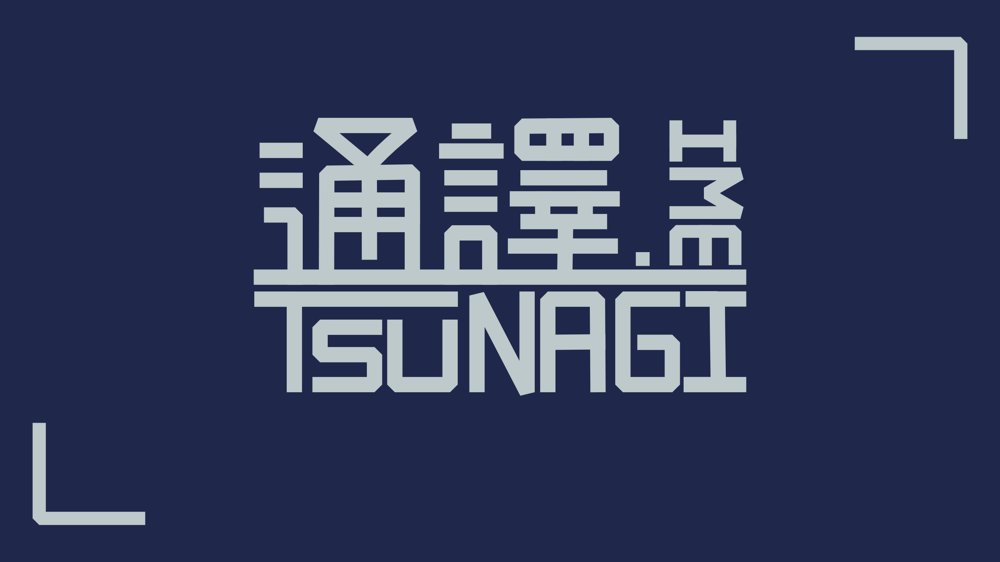

<div align="center">
  
</div>

# 通譯輸入法

> 通 · つなぎ · Tsunagi

自動辨識輸入語言（中文注音／英文／日文羅馬字）的輸入法，目標是**降低語言切換成本**，而非追求完全自動判斷。

不是翻譯工具——它「譯」的是你的按鍵意圖：同一串按鍵，引擎判斷你想打的是注音、日文羅馬字，還是英文。

## 怎麼打

**不用切換語言，直接打：**

| 你打 | 出來 |
|---|---|
| `su3cl3` | 你好 |
| `gohannwotabemasu` | ご飯を食べます |
| `hello` | hello |

引擎會依按鍵內容判斷語言。判斷錯了也有辦法救——**候選不是唯一的答案，是可以換的**。

| 按鍵 | 做什麼 |
|---|---|
| <kbd>Tab</kbd> | 換一種切法（這串按鍵有哪幾種分段方式） |
| <kbd>←</kbd> <kbd>→</kbd> | 在字與字之間移動 |
| <kbd>↑</kbd> <kbd>↓</kbd> | 叫出那一格的候選字 |
| <kbd>1</kbd>～<kbd>9</kbd> | 選候選（清單打開時） |
| <kbd>Ctrl</kbd>（單按） | 鎖定語言：自動 → 注音 → 日文 → 英文 |
| <kbd>Shift</kbd>+<kbd>空白</kbd> | 全形／半形 |
| <kbd>Enter</kbd> / <kbd>Esc</kbd> | 送出／取消 |

**鎖定注音**時的操作方式跟新酷音一致（音節緩衝、組字區顯示注音符號）。**鎖定英文**則完全不介入，等於暫時關掉輸入法——遇到某個程式相容性有問題時，這是逃生口。

**密碼欄位一律不介入**：偵測到就不組字、不彈候選，按鍵原樣進去。

## 現況

**Beta 測試中**。目標平台是 Windows（TSF），核心引擎以 Rust 開發、與平台層分離，以利日後移植 macOS（IMK）與 Linux（Fcitx5）。

| 階段 | 狀態 |
|---|---|
| Phase 0　TSF 骨架 | ✅ 記事本、瀏覽器、Word 三種環境實測通過 |
| Phase 1　合法性判斷 | ✅ 注音與日文引擎各 141/141 |
| Phase 2　切點引擎 | ✅ 570 句測資切點涵蓋 100%、正解進前三 98.4% |
| Phase 3　輸入 UX | ✅ 候選視窗（自繪 Direct2D）、切法選單、逐格選字、語言鎖定、全半形、主題與設定頁、工作列指示器、滑鼠選字 |
| Phase 4　智慧化與個人化 | ✅ 選字學習與切詞學習（你選過的會記住） |
| Phase 5　穩定性與發佈 | 🚧 進行中——效能與記憶體已達標、崩潰隔離完成、安裝程式完成；還缺程式碼簽章 |
| Phase 6　跨平台 | 未開始 |

量得出來的部分：**按鍵延遲 p99 10.5ms**（目標 16ms）、**常駐記憶體 23MB**（目標 50MB，多開一個程式只多約 6MB）、**文字正確率 94%**。

各階段的設計、取捨與踩坑紀錄整理在開發文件裡，目前尚未公開。

## 安裝

到 [Releases](../../releases) 下載 `tsunagi-ime-<版本>-setup.exe`，執行後照精靈走完即可。安裝程式會自動加進 Windows 的輸入法清單。

> **會跳 SmartScreen 警告。** 這個版本還沒有程式碼簽章（憑證要另外申請），Windows 對沒簽章的安裝程式一律會擋一下。要繼續的話按「其他資訊」→「仍要執行」。不放心的話請直接從原始碼建置——下一節有步驟。

解除安裝走「設定 → 應用程式」，會一併清掉註冊與資料夾。

## 自己建置

不裝安裝程式也可以自己建。需要 **Windows 11** 與 **Rust**（2021 edition）。

```powershell
# 1. 下載詞庫並編譯成二進位格式（約 119MB，只要做一次）
.\data\download.ps1

# 2. 建置 DLL 與設定頁
.\build-ime.ps1 -All
```

第 3 步要**在「以系統管理員身分執行」的終端機**裡跑——TSF 註冊會寫入 `HKLM`，一般權限會失敗：

```powershell
.\target\release\register_tool.exe register .\target\release\ime_tip_windows.dll
```

裝好之後在 Windows 的輸入法清單裡就看得到。反安裝把 `register` 換成 `unregister`。

> 改了程式碼**不需要重新註冊**，重跑 `.\build-ime.ps1` 即可——但**宿主程式要整個關掉重開**才會載到新版（開新分頁不夠）。

## 擴充包

你可以自己加詞表——遊戲名、專有名詞、常打的英文詞。加進來之後不只選字會有，連「這串按鍵是不是英文」的判斷都會跟著改。

複製 [擴充包範本.txt](擴充包範本.txt)、改名、放進 `%APPDATA%\tsunagi-ime\packs\`（預設位置，設定頁可以改），在設定頁的「擴充包」分頁勾起來就生效（不必重開輸入法）。格式是**純文字**，一行一個詞，中日英可以混在同一個包裡。

純文字是刻意的：包會流通，而輸入法看得到你打的每一個字，所以**收到的人要能自己打開檢查裡面是什麼**。

## 命名

| 場合 | 稱呼 |
|---|---|
| 台灣／中文 | 通譯輸入法 |
| 日文／國際 | 通（つなぎ）／ Tsunagi |
| Logo | 「通」一個字 |

「通」是三邊共有的錨。漢字寫「通譯」、日文讀「つなぎ」（繋ぎ＝連結）是刻意的義訓——字面說「通」，讀音說「連結」，是同一件事的兩面。

## 授權

程式碼採 **GPL-3.0-or-later**。

詞庫資料**不適用**這個授權——它們各自依照原始來源的條款（MIT、BSD-3-Clause、CC BY-ND 等）。哪份資料來自哪裡、各自什麼授權，列在 [CREDITS.md](CREDITS.md)。

分開標示是刻意的：把別人的資料一併宣告成 GPL-3，等於替它加上原始授權沒有給的權利。
