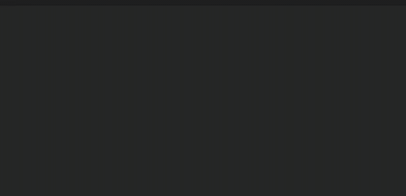
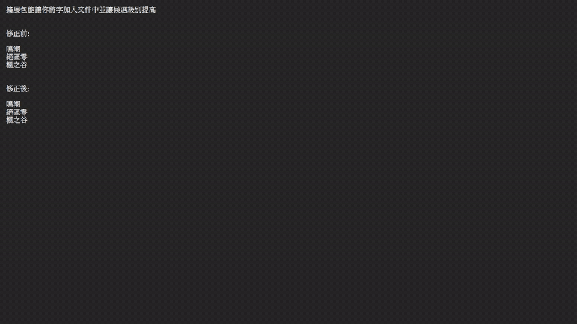
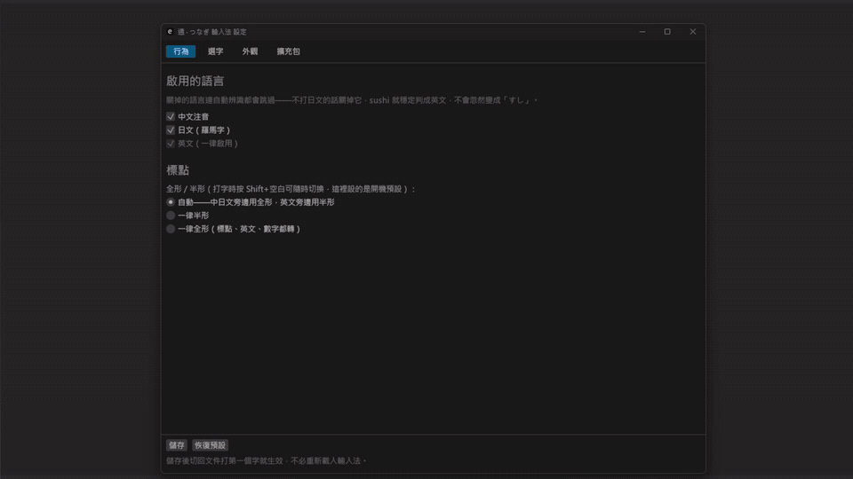
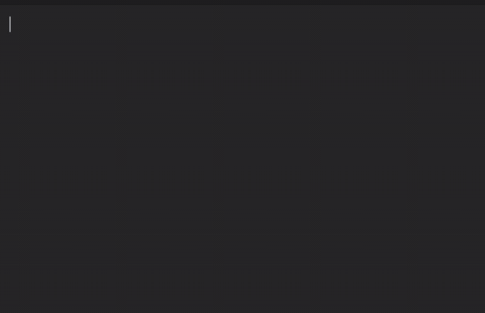
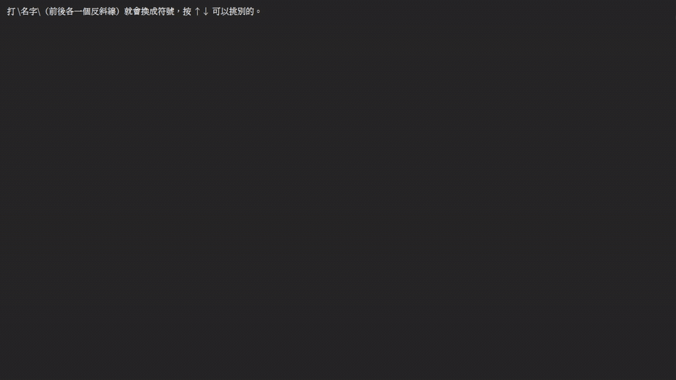

<div align="center">
  
</div>

# 通譯輸入法

> 通譯 · つなぎ · Tsunagi

那是一個悠閒的下午，我用著電腦打著日文的字幕翻譯「怎麼有人名又有專有名詞啊，煩死了。」「乾rup wu0 wu0 fu4cp3cl3xk7這是甚麼外星文?」，在越打越牙的情況下，決定來製作這款輸入法。
這是一款能夠自動辨識輸入語言（中文注音／英文／日文羅馬字）的輸入法，讓你不用再打出台灣特有加密文字的時候一直⭠Backspace，或是辛苦打一串英文之後才發現怎麼都是ㄍㄩㄛˊ

## 怎麼用?

切換到通譯輸入法之後，直接按照正常方式打字。它會自動辨識你打的是甚麼語言。

<div align="center">
  
</div>

| 你打                                         | 出來                   |
| ------------------------------------------ | -------------------- |
| `su3cl3`                                   | 你好                   |
| `gohannwotabemasu`                         | ご飯を食べます              |
| `hello`                                    | hello                |
| `ul41j6ul4fm4t lunch`                      | 要不要去吃lunch           |
| `rup wu0 g4uutennkikaraul41j6ul4tj fm4play?` | 今天是いい天気から、要不要出去play? |

會依按鍵內容判斷語言。判斷錯了也有辦法救——**候選不是唯一的答案，是可以換的**。

| 按鍵                                          | 做什麼                                     |
| ------------------------------------------- | ---------------------------------------- |
| <kbd>Tab</kbd>                              | 開段選單——引擎切錯的時候用（見下面「切錯了怎麼辦」） |
| <kbd>←</kbd> <kbd>→</kbd>                   | 進選字，在字與字之間移動                    |
| <kbd>↑</kbd> <kbd>↓</kbd>                   | 叫出那一格的候選——選字、選標點寫法、選符號都走這裡 |
| <kbd>1</kbd>～<kbd>9</kbd>                   | 直接挑候選（清單打開時。數字鍵盤也可以）        |
| <kbd>空白</kbd>                              | 選字時攤開全部候選，再按一次收回來             |
| <kbd>Shift</kbd>+<kbd>空白</kbd>             | 鎖定語言：自動 → 注音 → 日文 → 英文           |
| <kbd>Ctrl</kbd>+<kbd>Shift</kbd>+<kbd>空白</kbd> | 全形／半形（macOS 是 <kbd>⌘</kbd>+<kbd>Shift</kbd>+<kbd>空白</kbd>） |
| <kbd>Shift</kbd>+<kbd>←</kbd> <kbd>→</kbd>  | 拉寬拉窄——選字時拉日文詞界，段選單裡推段的邊界   |
| <kbd>↑</kbd><kbd>↑</kbd><kbd>↓</kbd><kbd>↓</kbd> | 快速設定（見下面「快速設定」）            |
| <kbd>Enter</kbd>                            | 清單打開著的時候是「就選這個」，打字中才是送出    |
| <kbd>Esc</kbd>                              | 退回上一層；打字中是把整串取消                |
| `\名字\`                               | 打出符號（見下面「符號」）                   |

滑鼠也能選——點候選視窗哪一列就選哪一個。

打字中**每一顆鍵都歸輸入法管**，包括 Home／End 這些。放行給宿主的話游標會跑出組字區，而輸入法還以為自己在組字，接下來打的字就跑到別的地方去了。


鎖定語言時，使用幾乎與一般輸入法相同。

## 切錯了怎麼辦

打 `loggerul4` 想要「logger ㄨㄞˋ」，結果切成 `log`＋`geru`＋`l4`——這時候按 <kbd>Tab</kbd> 開**段選單**。

它反白的不是整句，是引擎切出來的**一段**；往下選那一段要解釋成什麼：

```
組字區    [log] geru l4          ← 反白第一段，其餘照常顯示
候選視窗
          ┌──────────────┐
          │ 1  log    英 │ ← 現在的樣子
          │ 2  logger 英 │ ← 往右延伸
          │ 3  lo     英 │ ← 往左收縮
          │ 4  ログ   日  │ ← 換一種語言
          └──────────────┘
```

重點是**範圍跟語言列在同一張清單裡**。你不必先想「我這是切錯還是認錯語言」，看哪一行是你要的就挑哪一行。

| 按鍵 | 在段選單裡做什麼 |
| --- | --- |
| <kbd>Tab</kbd> | 開／關。關掉的時候已經定好的段留著 |
| <kbd>←</kbd> <kbd>→</kbd> | 換一段（反白左右移） |
| <kbd>↑</kbd> <kbd>↓</kbd> | 換這段的解釋（超過 9 個會跟著捲） |
| <kbd>Shift</kbd>+<kbd>←</kbd> <kbd>→</kbd> | 直接推邊界，跳過清單。只會跳到引擎認得的長度 |
| <kbd>1</kbd>～<kbd>9</kbd> | 直接挑第 n 項 |
| <kbd>Enter</kbd> | **定案這一段**——前面鎖住、後面重新算一次，反白自動跳到下一段 |
| <kbd>Esc</kbd> | 全部重來（關選單是 <kbd>Tab</kbd>） |

預覽列顯示的是「**按下 Enter 之後會變成什麼**」，所以推邊界、換候選的當下畫面就跟著動，不用按下去才知道。

定完一段之後**前面就不會再被推翻**了——後面重算的時候不會回頭把你選好的東西換掉。

台語走的也是這條路，只是鎖定注音的時候反白的單位是「詞」而不是「段」，清單也只列現況跟台語詞（那種情況下切法候選全是雜訊）。

# 功能
除了混合語言輸入以外，還有一些特別的設計，來解決目前輸入法會遇到的一些問題、改善使用體驗。

### 擴充包

> 【中驀地】【決區玲】【易氧化二輕】【假晚】【奈切あやめ】【音の瀬奏】
> 到底誰會需要這種排列組合?

擴充包可以讓你加入詞表——遊戲名、專有名詞、常打的英文詞。加進來之後不只選字會有，連「這串按鍵是不是英文」的判斷都會跟著改。

**在設定頁的「擴充包」分頁就能加詞改詞**——按「＋新增包」建一個，直接在表格裡打字，存檔就生效（不必重開輸入法）。查不到讀音的專有名詞可以自己填按鍵。

也可以用記事本寫：格式是**純文字**、一行一個詞，中日英能混在同一個包裡。複製 [擴充包範本.txt](擴充包範本.txt)、改名、放進 `%APPDATA%\tsunagi-ime\packs\`（預設位置，設定頁可以改），回設定頁按「重新整理」再勾起來。兩種方式編的是同一批檔案。

擴充包裡除了詞，也可以放**符號**——`sym` 開頭那種，一行給一組。名字自己取，打 `\名字\` 就叫得出你自己那一排；跟內建同名的話你的贏。只放符號、一個詞都沒有的包也是合法的包。

因為擴充包是可以流動的，所以你也可以把你的包分享出來給大家使用。

<div align="center">
  
</div>

### 台語
> 哩台語甘ㄟ輪轉？

用注音打華語詞，選出台語漢字。
打「ㄕㄚㄈㄚ」得到「沙發」，開段選單就能換成「膨椅」。

台語擴充包收了約 5 萬條華語↔台語的對照（資料來自[台文華文線頂辭典](https://github.com/ChhoeTaigi/ChhoeTaigiDatabase)），走的是段選單（見上面[切錯了怎麼辦](#切錯了怎麼辦)）——不佔平常打字的候選位置，只在你主動打開時才出現，也不必切換模式。反白的單位是「詞」，`←→` 跳詞、`Shift+←→` 調整範圍。

台語**不會進學習層**——選過的台語詞不會被記住並取代華語詞，每次都是這一次的選擇。這是刻意的：不然打過一次「感恩」之後，「謝謝」就永遠出不來了。

**台語包不在安裝程式裡**——它跟其他語言包會放在獨立的擴充包 repo，**整理中，稍後公布**。

拿到之後把檔案丟進擴充包資料夾（`%APPDATA%\tsunagi-ime\packs\`，macOS 是 `~/Library/Application Support/tsunagi-ime/packs/`），在設定頁的「擴充包」分頁按**重新整理**、把它勾起來就生效。資料夾還不存在的話那一頁有「建立」跟「開啟資料夾」。

### 注音模糊音

> 「ㄣ跟ㄥ到底差在哪？」「ㄓ還是ㄗ？我從小就分不出來。」

打 `ㄐㄧㄥ ㄊㄧㄢ` 但其實想打「今天」（`ㄐㄧㄣ`），照樣找得到。四組容錯：

| 這組 | 為什麼是這四組 |
| --- | --- |
| **ㄣ ↔ ㄥ** | 前後鼻音，台灣最常見 |
| **ㄓ ↔ ㄗ**、**ㄔ ↔ ㄘ**、**ㄕ ↔ ㄙ** | 捲舌／平舌，同一個成因（南部腔不分） |

`ㄢ/ㄤ`、`ㄋ/ㄌ`、`ㄈ/ㄏ` **刻意不做**——實際上不太有人搞混，加進去只是白白擴大誤傷面。

**預覽列會直接把注音改成正確的**，不是偷偷幫你查。你看得到它把 `ㄐㄧㄥ` 改成了 `ㄐㄧㄣ`，所以不會打完才發現被動過手腳。不需要的話設定頁可以關掉。

### 語言學習

> 說「一樣」的時候，沒有人真的需要「依樣」
> 說「或是」的時候，大部分人並不需要「獲釋」
> 說「一般」的時候，我並沒有兒子或女兒真的在「一班」
> 好了，我知道你（輸入法）可能不懂，但我改過了你不是應該要記起來嗎？屢教不改，罪該萬死！

在通譯輸入法中，它會學習你更正過的選字並記錄下來，你用的越多次，它會記得越深。不會是一次就學會，避免你選了一個生僻字之後就再也打不出一般的字了。

## 主題

> 「身為一個粉色愛好者，我連內褲都是粉色的，為何輸入法不可以是粉色的！？這太嚴重了。」
> －沒有人這樣說過，包括作者我。

支援自訂主題，你可以調整候選框的顏色，樣式等等，甚至還可以使用圖片。所有的設定也都是純文字檔，你可以把你製作的夢幻芭比粉主題分享給你的好兄弟用。

<div align="center">
  
</div>


## 快速設定

> 接招吧！↑ ↑ ↓ ↓ ← → ← → B A

可以利用想輸入的類型直接在輸入框輸入並搭配快速設定組合鍵來改變設定。例如你可以用任何語言輸入「設定」之後 再使用↑ ↑ ↓ ↓來快速進入輸入法的設定頁面，或是輸入語言來快速啟用和停用。

<div align="center">
  
</div>

## 智慧標點

> 這個符號到底要怎麼打？唉看來只能開word來複製了...糟糕，這台電腦沒有word...

自動模式下，直接輸入標點符號的按鍵，會根據前面一句的語言來自動套用相對應全半形的標點符號。在遇到比較少打或是不確定的符號情況下，可以打按鍵之後像選字一樣選用不同的標點符號。例如打"...(三個英文句號)"時能夠自動轉換為"…(刪節號)"，符號也支援使用擴充包建立，詳情參閱相關說明。

<div align="center">
  
</div>

## 符號

> 「★這個星星我知道怎麼念，但我不知道怎麼打。」

打 `\名字\`（前後各一個反斜線）就會換成符號，按 <kbd>↑</kbd><kbd>↓</kbd> 可以挑別的。名字是**你組出來的那幾個字**，不是按鍵——所以三種語言天然共用同一份表：

| 你打 | 出來 |
| --- | --- |
| `\`＋注音打「星」＋`\` | ★（☆✦✧⭐ 都在候選裡） |
| `\hoshi\` | ★（日文打「星」） |
| `\star\` | ★（英文名） |
| `\箭頭\` | →（←↑↓↔⇒ 都在） |

**沒選就不會變**——第一個候選永遠是你原本打的那串字。所以路徑裡剛好有同名資料夾（`C:\star\file`）打出來還是原樣，不會被吃掉。

內建收了四十組常用的（星、心、箭頭、勾叉、數學、圖形、音樂、天氣、貨幣、撲克……），不夠的話用擴充包自己加。

<div align="center">
  
</div>

## 語言停用
> 我又不會日文，給一堆あいうえお給我，我也用不到啊...

你可以利用上面的快速設定或是設定頁面中，關閉不需要的語言，這樣在混合輸入中被關閉的語言就不會參與辨識，可以讓剩下的語言辨識準確度大幅提升。

<div align="center">
  
</div>

# 隱私權聲明

- **密碼欄位不介入**－本輸入法不介入任何密碼欄位，也不學習，一切輸入皆直接送進文字欄中。
- **所有資料皆存於本機**－你所透過本輸入法所輸入的任何文字皆存於本地電腦中，不會推送到任何網路伺服器中。
- **帳號與號碼不會被學起來**－學習層有一道守門：看起來像帳號、電話、卡號那類的內容不會寫進 `learned.txt`。判斷看的是**內容本身**（例如五位以上的連續數字），不是欄位的名稱——瀏覽器對欄位的標記並不可靠。
- **唯一的連網行為是更新檢查**－設定頁的「關於」分頁會去 GitHub 查有沒有新版，只送出一個查詢、不帶任何個人資訊。**可以在設定頁關掉**，關掉之後就完全不連網。
# 現況

**1.0 正式版**。支援 **Windows**（TSF）與 **macOS**（InputMethodKit）。核心引擎以 Rust 開發、與平台層分離，兩個平台共用同一套引擎與設定頁；Linux（Fcitx5）還沒開始。

| 階段              | 狀態                                                        |
| --------------- | --------------------------------------------------------- |
| Phase 0　TSF 骨架  | ✅ 記事本、瀏覽器、Word 三種環境實測通過                                   |
| Phase 1　合法性判斷   | ✅ 注音與日文引擎各 141/141                                        |
| Phase 2　切點引擎    | ✅ 570 句測資切點涵蓋 100%、正解進前三 98.4%                            |
| Phase 3　輸入 UX   | ✅ 候選視窗（自繪 Direct2D）、段選單、逐格選字、語言鎖定、全半形、主題與設定頁、工作列指示器、滑鼠選字 |
| Phase 4　智慧化與個人化 | ✅ 選字學習與切詞學習（你選過的會記住）                                      |
| Phase 5　穩定性與發佈  | ✅ 效能與記憶體達標、崩潰隔離完成、安裝程式完成、相容性測試整份跑過；程式碼簽章第一版先不做  |
| Phase 6　跨平台     | 🚧 macOS 版已發布（Apple Silicon）；Linux 未開始                    |

量得出來的部分：**按鍵延遲 p99 10.5ms**（目標 16ms）、**記憶體增量 9.0MB**（只開記事本時，宿主載入輸入法前後的私有工作集差）、**測資通過率 90.3%**（1464 句全流程走完，四關全對才算通過）。

> 開多個程式**不會等比增加**——詞庫與官方擴充包都是 mmap 映射的，幾個程式共用同一份實體記憶體。五萬條的台語包在五個宿主底下只佔一份。

> 那個 90.3% 是**嚴格口徑**：一句話從合法性、切法、排序到選字全部正確才算過，長句要 20 段全對。所以它比「打十個字對幾個」那種算法低很多。測資裡刻意留著做不到的案例讓它紅著——排除掉數字會好看，但下次改動就無從得知有沒有修好。


## 安裝

到 [Releases](../../releases) 下載對應平台的檔案。安裝程式只裝輸入法本體——**語言擴充包（例如[台語](#台語)）另外下載**，丟進擴充包資料夾即可，不必重裝。

### Windows

需要 **Windows 11 的 x64 版本**。ARM64 沒有提供——手上沒有測試機，寧可不出也不要盲發。Windows 10 沒測過。

下載 `tsunagi-ime-<版本>-win-setup.exe`，執行後照精靈走完即可。安裝程式會自動加進 Windows 的輸入法清單。

> **會跳 SmartScreen 警告。** 這個版本還沒有程式碼簽章（憑證要另外申請），Windows 對沒簽章的安裝程式一律會擋一下。要繼續的話按「其他資訊」→「仍要執行」。不放心的話請直接從原始碼建置——下一節有步驟。

解除安裝走「設定 → 應用程式」，會一併清掉註冊與資料夾。

### macOS

需要 **macOS 13 以上的 Apple Silicon（M 系列）**。Intel 版沒有提供。

這個版本沒有 Apple 的簽章與公證，**第一次打開會被系統擋下**。這是正常的，放行的方式是：

1. 雙擊 `tsunagi-ime-<版本>-macos-unsigned.pkg`，系統跳出警告，按「完成」或「取消」關掉
2. 打開「系統設定 → 隱私權與安全性」，往下捲到「安全性」那一段
3. 那裡會出現一行說明剛才那個檔案被封鎖了，按旁邊的「**強制打開**」（有些版本寫「仍要打開」）
4. 輸入登入密碼，再雙擊一次 pkg 就裝得起來

> 那個按鈕**只在你嘗試打開之後約一小時內出現**。過期了就重做第 1 步。
> 詳見 Apple 的說明：[打開來自未知開發者的 Mac App](https://support.apple.com/zh-tw/guide/mac-help/mh40616/mac)

安裝範圍是「只供我使用」，不會動到系統目錄，不需要管理者密碼。

<details>
<summary>不想點來點去的話，用終端機兩行解決</summary>

```sh
xattr -dr com.apple.quarantine ~/Downloads/tsunagi-ime-<版本>-macos-unsigned.pkg
installer -pkg ~/Downloads/tsunagi-ime-<版本>-macos-unsigned.pkg -target CurrentUserHomeDirectory
```

第一行拿掉「從網路下載」的隔離標記，第二行安裝。跑完第一行之後也可以改成直接雙擊 pkg。

</details>

**安裝程式不會、也不能替你把輸入法打開**——macOS 規定輸入來源一定要使用者自己啟用。所以裝完要：

1. **登出再登入**（或重新開機），系統要重新掃描才看得到新的輸入法
2. **系統設定 → 鍵盤 → 輸入來源 → 編輯 → ＋ → 繁體中文 → 通譯-Tsunagi**

解除安裝在設定頁的「關於」分頁，也可以直接跑 `~/Library/Input\ Methods/Tsunagi.app/Contents/Resources/uninstall.sh`。**先按解除安裝、再去系統設定移除輸入來源**——反過來的話輸入法一停用就進不去設定頁了。

> **macOS 版少了什麼**：組字區的預覽列（組字中的文字由應用程式自己畫，輸入法插不了手）、候選視窗的背景圖／漸層／文字描邊／高光反白、系統字型選擇對話框（改成直接打字型名稱）——設定頁上那些項目會直接隱藏；以及「用 <kbd>Ctrl</kbd> + 那個鍵明講我要標點」，macOS 的輸入法收不到 <kbd>Ctrl</kbd> 組合鍵，這是系統的限制。

## 自己建置

不裝安裝程式也可以自己建。兩個平台都需要 **Rust**（2021 edition）。

### Windows

```powershell
# 1. 下載詞庫原始檔並編譯成二進位格式（只要做一次）
.\data\download.ps1

# 2. 建置 DLL 與設定頁
.\build-ime.ps1 -All
```

第 3 步要**在「以系統管理員身分執行」的終端機**裡跑——TSF 註冊會寫入 `HKLM`，一般權限會失敗：

```powershell
# 3. 註冊輸入法（提權終端機）
.\target\release\register_tool.exe register .\target\release\ime_tip_windows.dll
```

裝好之後在 Windows 的輸入法清單裡就看得到。反安裝把 `register` 換成 `unregister`。

> 改了程式碼**不需要重新註冊**，重跑 `.\build-ime.ps1` 即可——但**宿主程式要整個關掉重開**才會載到新版（開新分頁不夠）。

### macOS

需要 **Xcode 命令列工具**（`xcode-select --install`）與 **PowerShell**（`brew install powershell/tap/powershell`）——詞庫的下載腳本是 PowerShell 寫的，但**在 Mac 上跑得起來**。

```bash
# 1. 下載詞庫原始檔並編譯成二進位格式（只要做一次）
pwsh ./data/download.ps1

# 2. 建 .app 並裝進 ~/Library/Input Methods/
./platform/macos/build-app.sh --all

# 產發布用的 .pkg（詞庫打包進去）
./platform/macos/build-release.sh
```

裝好之後**登出再登入**，再到系統設定的輸入來源把它加進去。

> 改了程式碼重跑 `build-app.sh` 即可，但**要切走輸入法再切回來**——正在打字的程式可能還連著舊的行程。改圖示或輸入模式的定義則要跳 `CFBundleVersion`，macOS 會快取那些中繼資料。


## 授權

程式碼採 **GPL-3.0-or-later**。

詞庫資料**不適用**這個授權——它們各自依照原始來源的條款（MIT、BSD-3-Clause、CC BY-ND 等）。哪份資料來自哪裡、各自什麼授權，列在 [CREDITS.md](CREDITS.md)。

